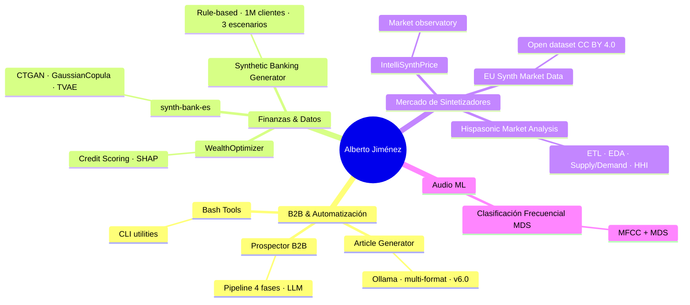

# Alberto Jiménez

**Data Scientist · Pipeline Builder | Python · LLM Pipelines · Automation**

---

## About Me

I build data pipelines and automation systems that remove friction from technical workflows.

My background is in industrial electronics and audio — that's still where I come from, but most of what I build today is Python pipelines: LLM-powered prospecting tools, market data observatories, financial scoring systems, and scraping infrastructure.

When a process is slow, manual, or repetitive, I build the tool that replaces it.

📍 Barcelona, Spain

---

## Featured Projects

| Project | Description | Tech |
|---------|-------------|------|
| 🔍 [**Prospector B2B**](https://github.com/albertjimrod/prospector-B2B) | 4-phase LLM pipeline for company discovery & prospecting: web audit, LinkedIn, YouTube, fit scoring | `Python` `Claude` `SerpAPI` `Selenium` `SQLite` |
| 💳 [**WealthOptimizer**](https://github.com/albertjimrod/wealthoptimizer) | Interactive credit risk scoring dashboard with SHAP explainability. AUC-ROC 0.918 | `Python` `Streamlit` `Scikit-learn` `SHAP` |
| 🎹 [**EU Synth Market Observatory**](https://github.com/albertjimrod/eusynth-market-data) | Open dataset of second-hand synthesizer prices from European marketplaces. CC BY 4.0 | `Python` `SQLite` `Docker` |
| 🤖 [**Article Generator**](https://github.com/albertjimrod/article-generator) | Converts technical notes into structured articles using local LLMs. v6.0: multi-format (.md .txt .ipynb .rst .pdf), Mermaid support, section-chunking for large docs | `Python` `Ollama` `Automation` |
| 🔊 [**Clasificación Frecuencial MDS**](https://github.com/albertjimrod/Clasificacion-Frecuencial-MDS) | Frequency classifier for audio samples using MFCC cross-correlation & MDS | `R` `warbleR` `igraph` |
| 🛠️ [**Bash Tools**](https://github.com/albertjimrod/bash_tools) | CLI utilities: Conda env manager, Git search, file deduplication | `Bash` `Automation` |
| 🏦 [**synth-bank-es**](https://github.com/albertjimrod/synth-bank-es) | Full pipeline: INE microdata → CTGAN / GaussianCopula / TVAE → statistical evaluation → Streamlit dashboard | `Python` `SDV` `CTGAN` `Streamlit` `Scipy` |
| 📊 [**Synthetic Banking Dataset Generator**](https://github.com/albertjimrod/Synthetic-banking-dataset-generator) | Rule-based generator of 1M+ synthetic banking customers across 3 economic scenarios. 52 fields, calibrated default model | `Python` `Pandas` `NumPy` `Multiprocessing` |
| 🎸 [**Hispasonic Market Analysis**](https://github.com/albertjimrod/hispasonic) | End-to-end pipeline on 5,962 second-hand synth listings: ETL, EDA, supply/demand modelling, HHI concentration, lagged correlation | `Python` `Pandas` `Scipy` `Seaborn` `JupyterLab` |

---

## Project Map

---

## Tech Stack

**Languages**

**LLM & AI**

**Data & ML**

**Web & Scraping**

**Infrastructure**

**BI & Visualization**

---

## Certifications

- 🧩 **LEGO Serious Play Facilitator** - Certified
- 📊 **Google Business Intelligence Professional** - [Coursera 2024](https://www.coursera.org/account/accomplishments/professional-cert/LLQOZY2Q1TDY)
- 📈 **Google Data Analytics** - [Coursera 2023](https://coursera.org/share/e330e85b9a469d87b9f8729bb552f095)
- 🐍 **Data Scientist in Python** - [Dataquest](https://app.dataquest.io/view_cert/UAGTJIPHITLCLNO8B7X3)
- 🎓 **Master in BI & Data Science** - [IEBS 2020](https://accounts.iebschool.com/mi-diploma/abaa0886b52591b851a33c17b4653f20/)

---

## GitHub Stats

---

**Let's connect!**

Data Science · Pipeline Builder · Automation — always building.

