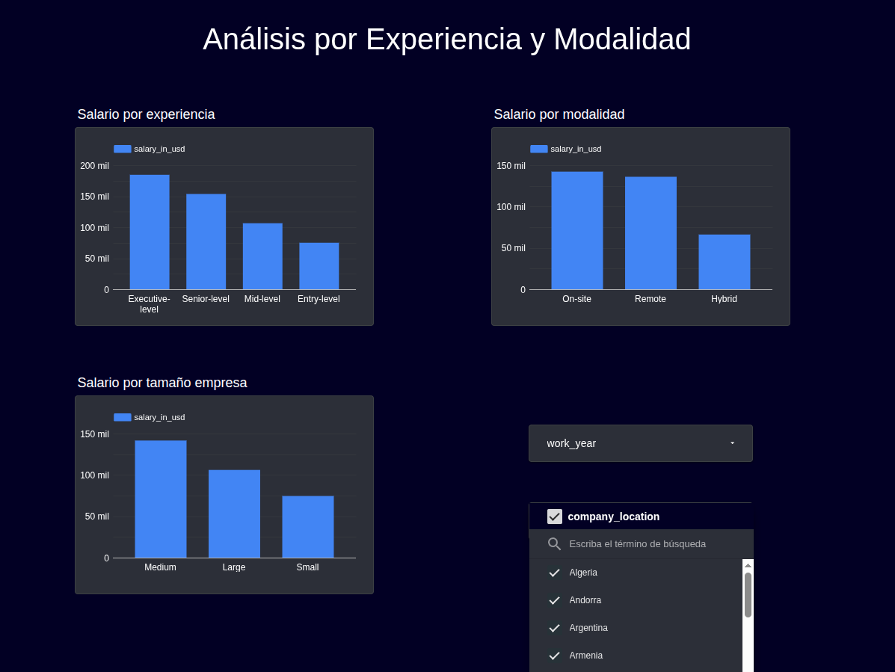
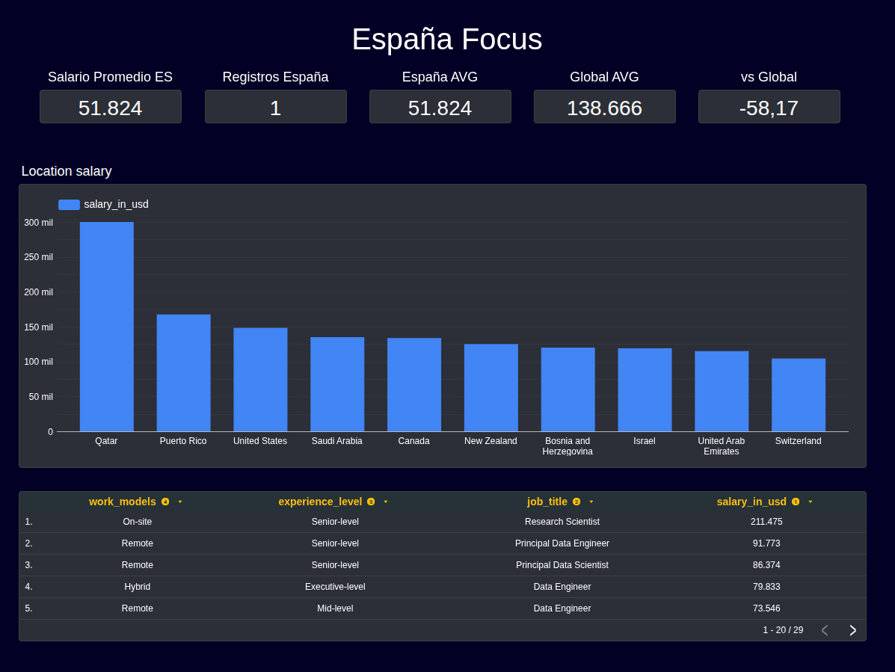

# Dashboard Mercado Laboral Data Science

Análisis interactivo del mercado laboral en Data Science (2020-2024) con foco en España.

[](https://lookerstudio.google.com/u/0/reporting/a8bfdf79-79a5-428b-b997-bd5b15a58d5e/page/p_1jmx3llm0d)

---

## Objetivo

Proporcionar insights accionables sobre el mercado laboral de Data Science para ayudar a profesionales a tomar decisiones de carrera informadas.

**Audiencia:** Profesionales de datos buscando empleo o negociando salario.

---

## Preguntas de Negocio

| Pregunta | Respuesta del Dashboard |
|----------|------------------------|
| ¿Cuál es el salario en España vs otros países? | España ~$31K vs USA ~$150K (-54% vs media global) |
| ¿Cómo evolucionan los salarios 2020-2024? | Tendencia creciente año a año |
| ¿Qué nivel de experiencia paga mejor? | Executive > Senior > Mid > Entry |
| ¿Remoto vs presencial afecta salario? | Remote y On-site pagan similar |
| ¿Qué roles pagan más? | Data Engineer y ML Engineer lideran |
| ¿Tamaño empresa influye? | Empresas M y L pagan más que S |

---

## Capturas

### Página 1: Executive Summary


### Página 2: Análisis por Experiencia y Modalidad


### Página 3: España Focus


---

## Dataset

- **Fuente:** [Kaggle - Data Science Salaries](https://www.kaggle.com/datasets/hummaamqaasim/jobs-in-data)
- **Registros:** 6,600 ofertas de empleo
- **Período:** 2020-2024
- **Campos principales:** job_title, experience_level, salary_in_usd, company_location, work_models, company_size

---

## Tecnologías

- **Visualización:** Looker Studio
- **Datos:** CSV (Google Sheets como fuente)
- **Análisis previo:** Python / Pandas

---

## Decisiones de Diseño

1. **Métrica principal:** `salary_in_usd` (normalizado) en lugar de `salary` (moneda local)
2. **Agregación:** Promedio (AVG) para comparativas salariales
3. **Filtros:** A nivel de página para análisis independiente por sección
4. **KPI diferencial:** Campo calculado `es_vs_global_diff` para mostrar -54% España vs Global
5. **3 páginas:** Resumen ejecutivo → Análisis detallado → Foco geográfico

---

## Estructura del Proyecto

```
01_dashboard_mercado_laboral/
├── data/
│   └── raw/
│       └── data_science_salaries.csv
├── docs/
│   └── proyecto_dashboard.md
├── outputs/
│   ├── page1_executive_summary.png
│   ├── page2_experiencia_modalidad.png
│   └── page3_espana_focus.png
└── README.md
```

---

## Autor

**Alberto Jiménez**
[](https://datablogcafe.com)
[](https://www.linkedin.com/in/albertjimrod/)

---

## Licencia

MIT License - Libre para uso educativo y profesional.
